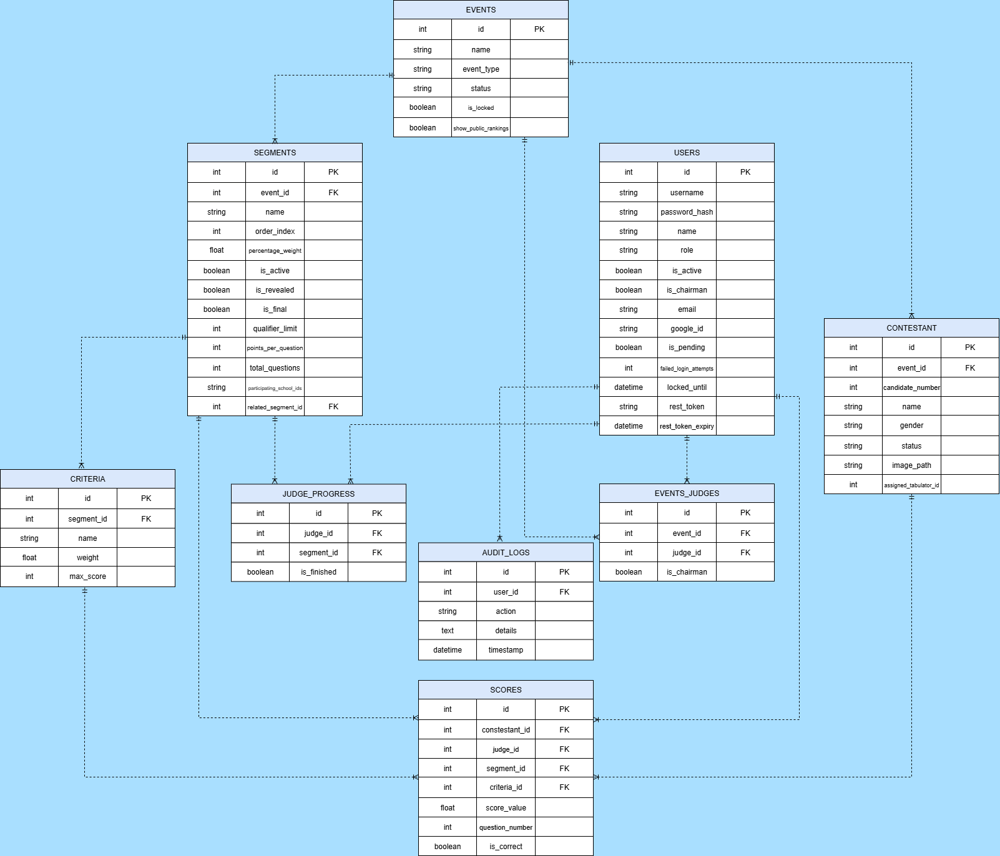

# **2\. Technical Documentation**

## **2.1 System Architecture Diagram**

The JudgeMeNot system is a Python-based monolithic application.

classDiagram  
    class MainWindow {  
        \+main(page)  
        \+route\_change()  
    }  
    class AuthService {  
        \+login()  
        \+register()  
    }  
    class PageantService {  
        \+submit\_score()  
        \+calculate\_standings()  
    }  
    class Database {  
        \+SessionLocal  
        \+engine  
    }  
      
    MainWindow \--\> AuthService : Uses  
    MainWindow \--\> PageantService : Uses  
    AuthService \--\> Database : Queries  
    PageantService \--\> Database : Queries

## **2.2 Database Schema (ERD)**
The JudgeMeNot System database consists of nine entities intricately linked to one another, with EVENTS and USERS at the core, the latter comprising CONTESTANTs and judges as specified in EVENTS_JUDGES. EVENTS are further divided into SEGMENTS, which are judged based on specific CRITERIA. 

The principal operation is represented by the SCORES table, which associates a CONTESTANT, a JUDGE, a SEGMENT, and a CRITERIA to document the score value awarded. JUDGE_PROGRESS, which monitors the judge's assignment and completion status, and AUDIT_LOGS, which by recording all essential user actions and their respective timestamps, ensures system accountability, are among the features that support the judging workflow. 

With this setup, the entire competitive event management cycle is possible, from defining rules and tracking contestants to scoring based on detailed criteria and auditing the system.

The database judgemenot\_db consists of the following key entities:

* **Users:** (id, username, password\_hash, role) \- Stores Admins, Judges, and Tabulators.  
* **Events:** (id, name, type, status) \- The root entity.  
* **Segments:** (id, event\_id, weight, is\_final) \- Represents rounds (e.g., "Talent", "Q\&A").  
* **Criteria:** (id, segment\_id, weight, max\_score) \- Specific scoring criteria (e.g., "Poise 40%").  
* **Contestants:** (id, event\_id, name, number) \- Participants.  
* **Scores:** (id, judge\_id, contestant\_id, criteria\_id, value) \- The transactional data.  
* **AuditLogs:** (id, user\_id, action, details) \- Security trail.

## **2.3 Configuration & Environment Variables**

The application uses a .env file or environment variables for database connection.

| Variable | Default | Description |
| :---- | :---- | :---- |
| db\_username | root | MySQL Username |
| db\_pass | *(empty)* | MySQL Password |
| db\_host | localhost | Database Host Address |
| \_\_app\_id | default | (Internal) App ID for session handling |

## **2.4 API Specification (Service Layer)**

While not a REST API, the Service Layer acts as the internal API:

**AuthService**

* login(username, password) \-\> Returns User object or None.  
* register\_self\_service(...) \-\> Creates a pending User.

**PageantService**

* submit\_score(judge\_id, contestant\_id, criteria\_id, score) \-\> Saves score & logs action.  
* get\_active\_segment(event\_id) \-\> Returns the currently unlocked round.  
* activate\_final\_round(event\_id, limit) \-\> Calculates prelims and promotes Top N candidates.

**QuizService**

* submit\_answer(...) \-\> Records correct/wrong status.  
* check\_round\_ties(...) \-\> Detects deadlocks for automated Clincher generation.