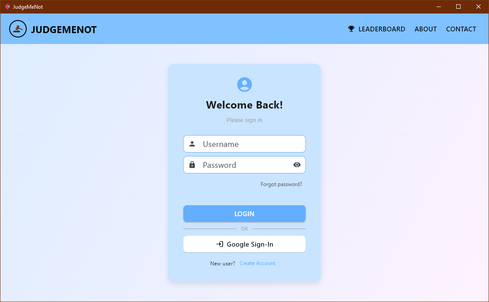
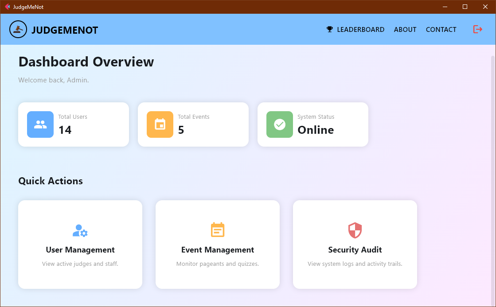
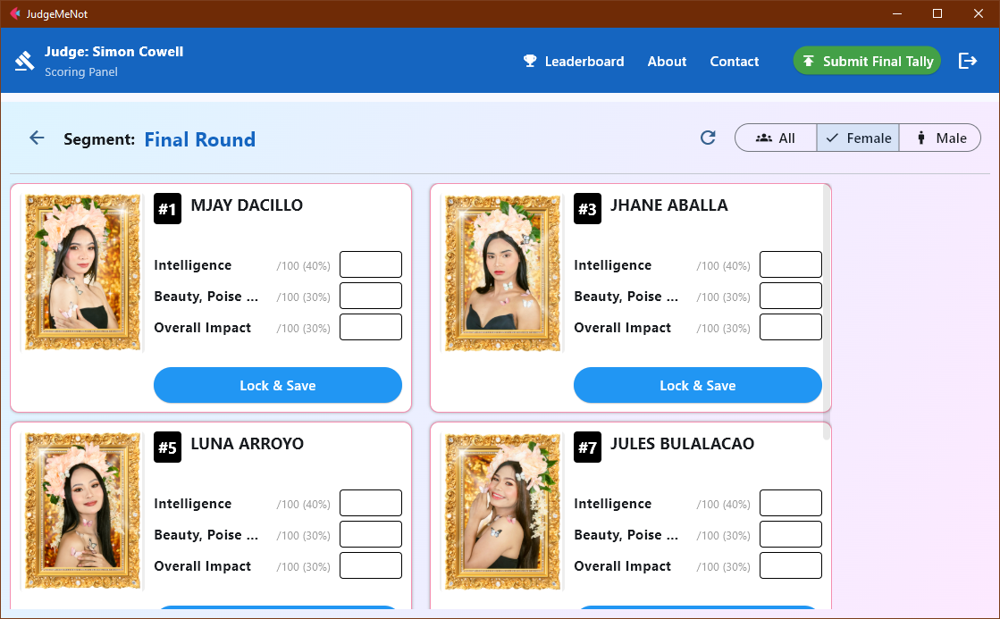
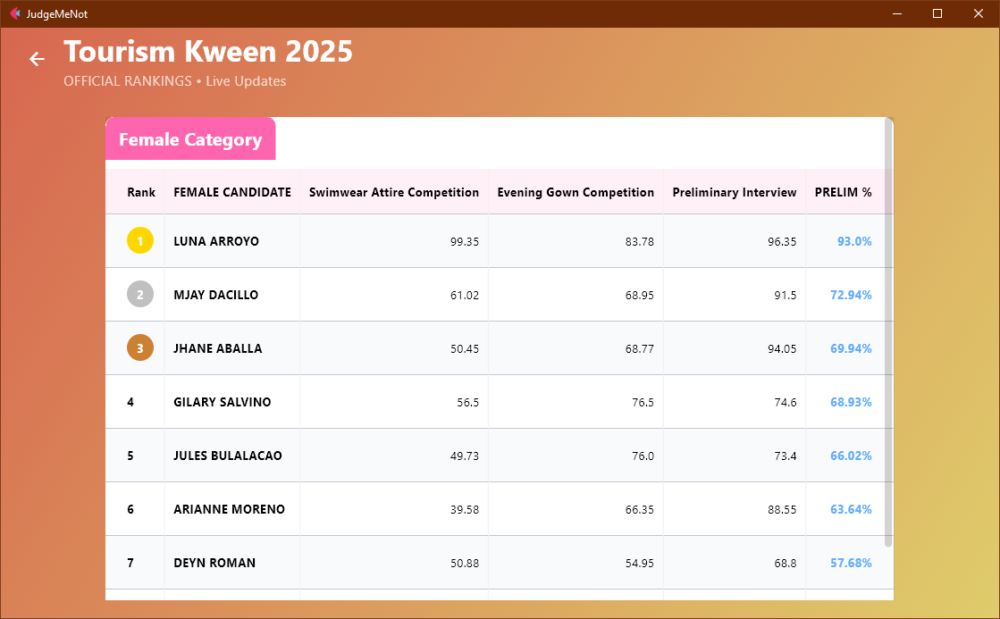

# **3\. User Manual**

## **3.1 Installation & Setup**

**Prerequisites:**

1. Python 3.8 or higher.  
2. XAMPP (or MySQL Server) running.  
3. Git.

**Step-by-Step Guide:**

1. **Clone the Repository:**  
   git clone \<repo\_url\>  
   cd JudgeMeNot\_System

2. **Virtual Environment (Recommended):**  
   python \-m venv venv  
   \# Windows:  
   venv\\Scripts\\activate  
   \# Mac/Linux:  
   source venv/bin/activate

3. **Install Dependencies:**  
   pip install \-r requirements.txt

4. Database Initialization:  
   Ensure MySQL is running. This script creates the DB and the default admin account.  
   python init\_db.py

5. **Run the Application:**  
   flet run main.py

   *Note: The console will print the Local IP URL (e.g., http://192.168.1.5:8550). Judges on the same Wi-Fi can access this URL.*

## **3.2 Roles & Capabilities**

### **Administrator**

* **Login:** Username admin / Password admin123 (Default).  
* **Capabilities:**  
  * Create/Delete Events.  
  * Manage Users (Approve signups, reset passwords).  
  * Configure Scoring (Add rounds, criteria, weights).  
  * **Control Panel:** Activate/Deactivate segments to unlock judging.  
  * View Audit Logs.

### **Judge**

* **Capabilities:**  
  * View assigned active events.  
  * Score contestants using sliders/inputs (0-100).  
  * **Lock & Save:** Scores cannot be changed once the round is closed.

### **Tabulator (Quiz Bee)**

* **Capabilities:**  
  * Assigned to specific schools/contestants.  
  * Input answers (Correct/Wrong) for their assignee during live quizzes.

### **Viewer / Leaderboard**

* **Capabilities:**  
  * Read-only view of live ranks.  
  * Auto-refreshes every few seconds.

## **3.3 UI Navigation**

* **Login Screen:** Standard username/password field with "Sign Up" for new judges/tabulators.  

* **Admin Dashboard:** A card-based layout showing "User Management", "Event Management", and "Security Logs".

* **Scoring Screen:** Displays the current candidate's photo (if available) on the left, and scoring fields on the right. A "Lock" button saves the score.  

* **Leaderboard:** A large table displaying Rank, Candidate Name, and Computed Score. Top 3 are highlighted in Gold/Silver/Bronze.
